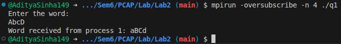
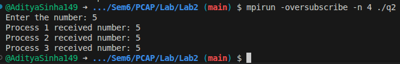
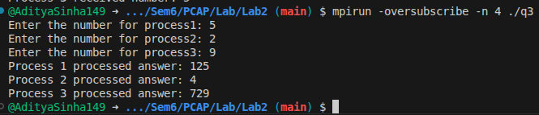
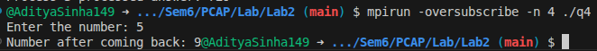

## Lab-2 Point to Point COmmunications in MPI

```c
// Title : MPI program to use synchronous send. Send a word from P0 to P1, toggle letters, and send it back.
// Author : Aditya Sinha
// Date : 16/1/2026

#include <stdio.h>
#include <mpi.h>
#include <string.h>

void toggleWord(char *s);
void toggle(char *s, int i);

int main(int argc, char *argv[]) {
    int rank;
    MPI_Status status;
    char word[100];

    MPI_Init(&argc, &argv);
    MPI_Comm_rank(MPI_COMM_WORLD, &rank);

    if (rank == 0) {
        printf("Enter the word:\n");
        scanf("%99s", word);

        MPI_Ssend(word, 100, MPI_CHAR, 1, 0, MPI_COMM_WORLD);
        MPI_Recv(word, 100, MPI_CHAR, 1, 0, MPI_COMM_WORLD, &status);

        printf("Word received from process 1: %s\n", word);
    }
    else if (rank == 1) {
        MPI_Recv(word, 100, MPI_CHAR, 0, 0, MPI_COMM_WORLD, &status);
        toggleWord(word);
        MPI_Ssend(word, 100, MPI_CHAR, 0, 0, MPI_COMM_WORLD);
    }

    MPI_Finalize();
    return 0;
}

void toggleWord(char *s) {
    int i = 0;
    while (s[i] != '\0') {
        toggle(s, i);
        i++;
    }
}

void toggle(char *s, int i) {
    if (s[i] >= 'a' && s[i] <= 'z')
        s[i] = s[i] - 'a' + 'A';
    else if (s[i] >= 'A' && s[i] <= 'Z')
        s[i] = s[i] - 'A' + 'a';
}

```



```c
// Title : Master process sends a number and slaves print it using MPI_Bsend
// Author : Aditya Sinha
// Date : 16/1/2026

#include <stdio.h>
#include <stdlib.h>
#include <mpi.h>

int main(int argc, char *argv[]) {
    int rank, size;
    int num;
    MPI_Status status;

    MPI_Init(&argc, &argv);
    MPI_Comm_rank(MPI_COMM_WORLD, &rank);
    MPI_Comm_size(MPI_COMM_WORLD, &size);

    int buffer_size = size * (sizeof(int) + MPI_BSEND_OVERHEAD);
    void *buffer = malloc(buffer_size);
    MPI_Buffer_attach(buffer, buffer_size);

    if (rank == 0) {
        printf("Enter the number: ");
        fflush(stdout);
        scanf("%d", &num);

        for (int i = 1; i < size; i++) {
            MPI_Bsend(&num, 1, MPI_INT, i, 0, MPI_COMM_WORLD);
        }
    } else {
        MPI_Recv(&num, 1, MPI_INT, 0, 0, MPI_COMM_WORLD, &status);
        printf("Process %d received number: %d\n", rank, num);
    }

    MPI_Buffer_detach(&buffer, &buffer_size);
    free(buffer);

    MPI_Finalize();
    return 0;
}
```



```c
// Title : Master process sends a number and even and odd ranked slaves print square and cube of the number respectively.
// Author : Aditya Sinha
// Date : 16/1/2026

#include <stdio.h>
#include <stdlib.h>
#include <mpi.h>

int main(int argc, char *argv[]) {
    int rank, size;
    MPI_Status status;

    MPI_Init(&argc, &argv);
    MPI_Comm_rank(MPI_COMM_WORLD, &rank);
    MPI_Comm_size(MPI_COMM_WORLD, &size);

    int *num = malloc(sizeof(int)*(size));

    int buffer_size = size * (sizeof(int) + MPI_BSEND_OVERHEAD);
    void *buffer = malloc(buffer_size);
    MPI_Buffer_attach(buffer, buffer_size);

    if (rank == 0) {
        for(int i = 1; i < size; i++) {
            printf("Enter the number for process%d: ", i);
            fflush(stdout);
            scanf("%d", num+i);
        }

        for (int i = 1; i < size; i++) {
            MPI_Bsend(num+i, 1, MPI_INT, i, 0, MPI_COMM_WORLD);
        }
    } else {
        MPI_Recv(num + rank, 1, MPI_INT, 0, 0, MPI_COMM_WORLD, &status);
        printf("Process %d processed answer: %d\n", rank, (rank&1) == 0 ? num[rank]*num[rank] : num[rank]*num[rank]*num[rank]);
    }

    MPI_Buffer_detach(&buffer, &buffer_size);
    free(buffer);

    MPI_Finalize();
    return 0;
}
```



```c
// Title : p0->p1->p2......->pn->p0. number gets added by 1 everytime.
// Author : Aditya Sinha
// Date : 16/1/2026

#include <stdio.h>
#include <stdlib.h>
#include <mpi.h>

int main(int argc, char *argv[]) {
    int rank, size;
    MPI_Status status;

    MPI_Init(&argc, &argv);
    MPI_Comm_rank(MPI_COMM_WORLD, &rank);
    MPI_Comm_size(MPI_COMM_WORLD, &size);

    int num;
    
    if(rank == 0){
        printf("Enter the number: ");
        fflush(stdout);
        scanf("%d", &num);
        num++;
        MPI_Send( &num , 1 , MPI_INT , 1 , 0 , MPI_COMM_WORLD);
        MPI_Recv( &num , 1 , MPI_INT , size - 1 , 0 , MPI_COMM_WORLD , &status);
        printf("Number after coming back: %d", num);
    }

    else if(rank == size - 1){
        MPI_Recv( &num , 1 , MPI_INT , rank - 1 , 0 , MPI_COMM_WORLD , &status);
        num++;
        MPI_Send( &num , 1 , MPI_INT , 0 , 0 , MPI_COMM_WORLD);
    }

    else{
        MPI_Recv( &num , 1 , MPI_INT , rank - 1 , 0 , MPI_COMM_WORLD , &status);
        num++;
        MPI_Send( &num , 1 , MPI_INT , rank + 1 , 0 , MPI_COMM_WORLD);
    }

    MPI_Finalize();
    return 0;
}
```

