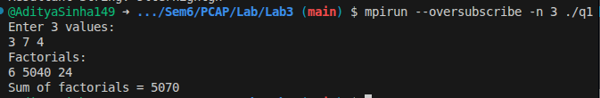
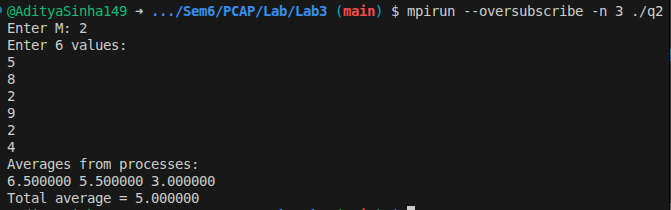
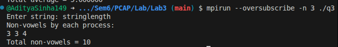
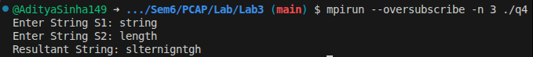

## Lab-3 Collective Communications in MPI

```c
// Title  : MPI Program to Compute Factorials Using Scatter and Gather
// Author : Aditya Sinha
// Date   : 23/01/2026

#include <mpi.h>
#include <stdio.h>

long long factorial(int n) {
    long long f = 1;
    for (int i = 1; i <= n; i++) f *= i;
    return f;
}

int main(int argc, char *argv[]) {
    int rank, size;
    MPI_Init(&argc, &argv);
    MPI_Comm_rank(MPI_COMM_WORLD, &rank);
    MPI_Comm_size(MPI_COMM_WORLD, &size);

    int values[size];
    int recv_val;
    long long fact;
    long long facts[size];

    if (rank == 0) {
        printf("Enter %d values:\n", size);
        for (int i = 0; i < size; i++)
            scanf("%d", &values[i]);
    }

    MPI_Scatter(values, 1, MPI_INT, &recv_val, 1, MPI_INT, 0, MPI_COMM_WORLD);

    fact = factorial(recv_val);

    MPI_Gather(&fact, 1, MPI_LONG_LONG, facts, 1, MPI_LONG_LONG, 0, MPI_COMM_WORLD);

    if (rank == 0) {
        long long sum = 0;
        printf("Factorials:\n");
        for (int i = 0; i < size; i++) {
            printf("%lld ", facts[i]);
            sum += facts[i];
        }
        printf("\nSum of factorials = %lld\n", sum);
    }

    MPI_Finalize();
    return 0;
}


```



```c
// Title  : MPI Program to Compute Averages Using Scatter and Gather
// Author : Aditya Sinha
// Date   : 23/01/2026

#include <mpi.h>
#include <stdio.h>
#include <stdlib.h>

int main(int argc, char *argv[]) {
    int rank, size;
    MPI_Init(&argc, &argv);
    MPI_Comm_rank(MPI_COMM_WORLD, &rank);
    MPI_Comm_size(MPI_COMM_WORLD, &size);

    int M;
    float *data = NULL;
    float *recv_buf;
    float avg, avgs[size];

    if (rank == 0) {
        printf("Enter M: ");
        fflush(stdout);
        scanf("%d", &M);

        data = (float *)malloc(sizeof(float) * M * size);
        printf("Enter %d values:\n", M * size);
        for (int i = 0; i < M * size; i++)
            scanf("%f", &data[i]);
    }

    MPI_Bcast(&M, 1, MPI_INT, 0, MPI_COMM_WORLD);

    recv_buf = (float *)malloc(sizeof(float) * M);

    MPI_Scatter(data, M, MPI_FLOAT, recv_buf, M, MPI_FLOAT, 0, MPI_COMM_WORLD);

    float sum = 0;
    for (int i = 0; i < M; i++)
        sum += recv_buf[i];

    avg = sum / M;

    MPI_Gather(&avg, 1, MPI_FLOAT, avgs, 1, MPI_FLOAT, 0, MPI_COMM_WORLD);

    if (rank == 0) {
        float total_avg = 0;
        printf("Averages from processes:\n");
        for (int i = 0; i < size; i++) {
            printf("%f ", avgs[i]);
            total_avg += avgs[i];
        }
        total_avg /= size;
        printf("\nTotal average = %f\n", total_avg);
        free(data);
    }

    free(recv_buf);
    MPI_Finalize();
    return 0;
}
```



```c
// Title  : MPI Program to Count Non-Vowels Using Scatter and Gather
// Author : Aditya Sinha
// Date   : 23/01/2026

#include <mpi.h>
#include <stdio.h>
#include <string.h>
#include <ctype.h>

int is_vowel(char c) {
    c = tolower(c);
    return (c=='a'||c=='e'||c=='i'||c=='o'||c=='u');
}

int main(int argc, char *argv[]) {
    int rank, size;
    MPI_Init(&argc, &argv);
    MPI_Comm_rank(MPI_COMM_WORLD, &rank);
    MPI_Comm_size(MPI_COMM_WORLD, &size);

    char str[256];
    char recv_buf[64];
    int counts[size];

    int len, chunk;
    int count = 0;

    if (rank == 0) {
        printf("Enter string: ");
        fflush(stdout);
        scanf("%s", str);
        len = strlen(str);
    }

    MPI_Bcast(&len, 1, MPI_INT, 0, MPI_COMM_WORLD);
    chunk = len / size;

    MPI_Scatter(str, chunk, MPI_CHAR, recv_buf, chunk, MPI_CHAR, 0, MPI_COMM_WORLD);

    for (int i = 0; i < chunk; i++) {
        if (!is_vowel(recv_buf[i]))
            count++;
    }

    MPI_Gather(&count, 1, MPI_INT, counts, 1, MPI_INT, 0, MPI_COMM_WORLD);

    if (rank == 0) {
        int total = 0;
        printf("Non-vowels by each process:\n");
        for (int i = 0; i < size; i++) {
            printf("%d ", counts[i]);
            total += counts[i];
        }
        printf("\nTotal non-vowels = %d\n", total);
    }

    MPI_Finalize();
    return 0;
}
```



```c
// Title  : MPI Program to Merge Two Strings Using Scatter and Gather
// Author : Aditya Sinha
// Date   : 23/01/2026

#include <mpi.h>
#include <stdio.h>
#include <string.h>

int main(int argc, char *argv[]) {
    int rank, size;
    MPI_Init(&argc, &argv);
    MPI_Comm_rank(MPI_COMM_WORLD, &rank);
    MPI_Comm_size(MPI_COMM_WORLD, &size);

    char s1[256], s2[256], result[512];
    char buf1[64], buf2[64], buf_res[128];

    int len, chunk;

    if (rank == 0) {
        printf("Enter String S1: ");
        fflush(stdout);
        scanf("%s", s1);
        printf("Enter String S2: ");
        fflush(stdout);
        scanf("%s", s2);
        len = strlen(s1);
    }

    MPI_Bcast(&len, 1, MPI_INT, 0, MPI_COMM_WORLD);
    chunk = len / size;

    MPI_Scatter(s1, chunk, MPI_CHAR, buf1, chunk, MPI_CHAR, 0, MPI_COMM_WORLD);
    MPI_Scatter(s2, chunk, MPI_CHAR, buf2, chunk, MPI_CHAR, 0, MPI_COMM_WORLD);

    int k = 0;
    for (int i = 0; i < chunk; i++) {
        buf_res[k++] = buf1[i];
        buf_res[k++] = buf2[i];
    }

    MPI_Gather(buf_res, 2 * chunk, MPI_CHAR, result, 2 * chunk, MPI_CHAR, 0, MPI_COMM_WORLD);

    if (rank == 0) {
        result[2 * len] = '\0';
        printf("Resultant String: %s\n", result);
    }

    MPI_Finalize();
    return 0;
}
```

