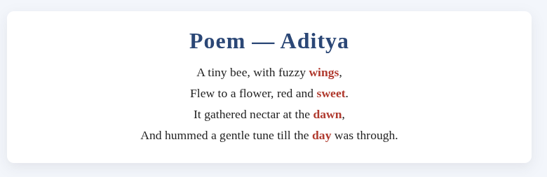
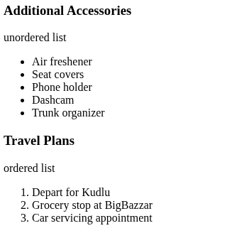
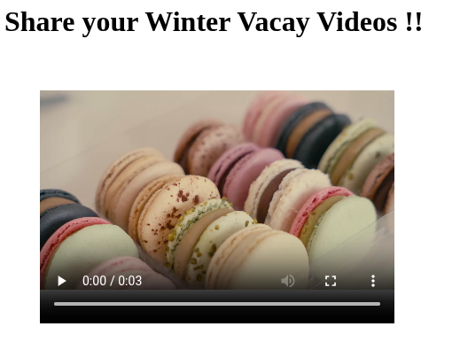

# Lab 1 — HTML and CSS Basics

**Name:** Aditya Sinha<br>
**Reg. No:** 230905218<br>
**Class & Section:** CSE-A1<br>
**Roll No:** 27

---

## Question 1

### Write a simple poem and represent it as a web page. Give a title for the poem.

Make rhyming words in the poem as bold.

**Code:**

```html
<!DOCTYPE html>
<html>
  <head>
    <title>POEM BY ADITYA</title>
    <meta charset="utf-8" />
    <meta name="viewport" content="width=device-width,initial-scale=1" />
    <style>
      body {
        background: #f3f6fb;
        font-family: Georgia, "Times New Roman", serif;
        color: #222;
      }
      .container {
        max-width: 700px;
        margin: 48px auto;
        background: #fff;
        padding: 24px;
        border-radius: 10px;
        box-shadow: 0 6px 18px rgba(27, 31, 35, 0.08);
      }
      h1 {
        margin: 0 0 12px;
        text-align: center;
        color: #2b4776;
        letter-spacing: 1px;
      }
      .poem {
        font-size: 1.1rem;
        line-height: 1.7;
        text-align: center;
        margin: 0;
      }
      .poem b {
        color: #b03a2e;
      }
    </style>
  </head>
  <body>
    <div class="container">
      <h1>Poem — Aditya</h1>
      <p class="poem">
        A tiny bee, with fuzzy <b>wings</b>,<br />
        Flew to a flower, red and <b>sweet</b>.<br />
        It gathered nectar at the <b>dawn</b>,<br />
        And hummed a gentle tune till the <b>day</b> was through.
      </p>
    </div>
  </body>
</html>
```

**Output:**



---

## Question 2

### Assume you have brought a new car. Write down the list of additional accessories you need for the car as an unordered list in HTML. Also, list the travel plans on the car as an ordered list.

**Code:**

```html
<!DOCTYPE html>
<html>
  <head>
    <title>MY NEW CAR</title>
  </head>
  <body>
    <h3>Additional Accessories</h3>
    <p>unordered list</p>
    <ul>
      <li>Air freshener</li>
      <li>Seat covers</li>
      <li>Phone holder</li>
      <li>Dashcam</li>
      <li>Trunk organizer</li>
    </ul>
    <h3>Travel Plans</h3>
    <p>ordered list</p>
    <ol>
      <li>Depart for Kudlu</li>
      <li>Grocery stop at BigBazzar</li>
      <li>Car servicing appointment</li>
    </ol>
  </body>
</html>
```

**Output:**



---

## Question 3

### Complete the following website name "Share your Winter Vacation Videos". The required video files are located inside the compressed folder "Week 1 Assignment Files/Media/".

**Code:**

```html
<!DOCTYPE html>
<html>
  <head>
    <title>Share your Winter Vacay Videos !!</title>
  </head>
  <body>
    <h1>Share your Winter Vacay Videos !!</h1>
    <figure>
      <video controls width="400" height="300">
        <source src="/home/VI_WPL_A1/Downloads/decor.webm" type="video/webm" />
        <source src="/home/VI_WPL_A1/Downloads/decor.mp4" type="video/mp4" />
        <source src="/home/VI_WPL_A1/Downloads/decor.ogv" type="video/ogg" />
        your browser does not support this video extension
      </video>
    </figure>
  </body>
</html>
```

**Output:**



---
