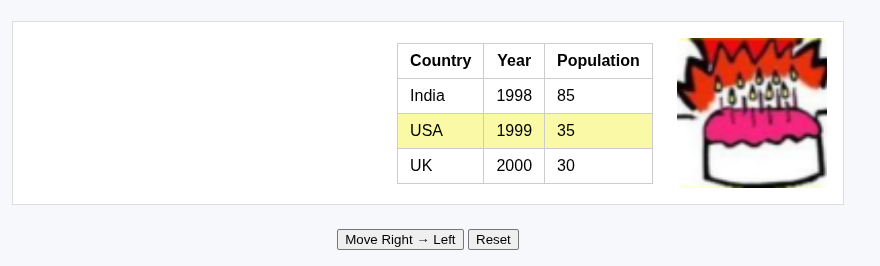
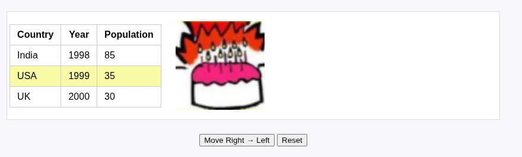
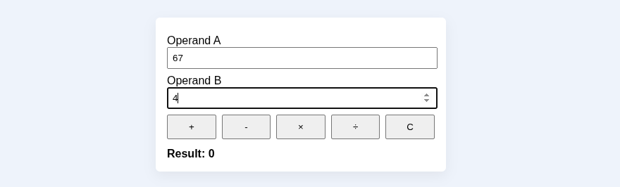
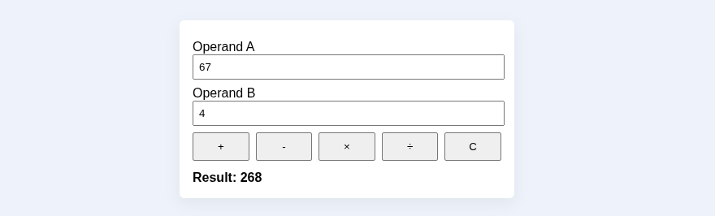
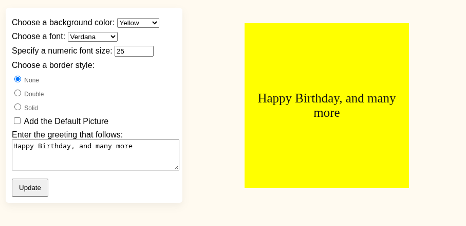
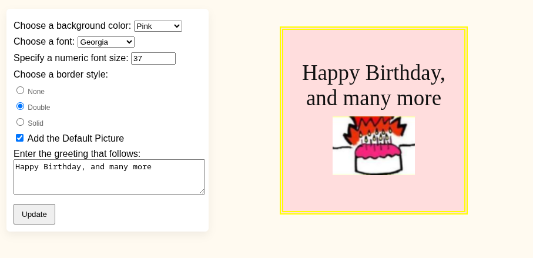

# Lab 2 — jQuery

**Name:** Aditya Sinha<br>
**Reg. No:** 230905218<br>
**Class & Section:** CSE-A1<br>
**Roll No:** 27

---

## Question 1

### Write a web page which contains table with 3 X 3 dimensions (fill some data) and one image. Style the rows with alternate color. Move the table and image together from right to left when button is clicked.

**Code:**

```html
<!DOCTYPE html>
<html lang="en">
  <head>
    <meta charset="utf-8" />
    <meta name="viewport" content="width=device-width,initial-scale=1" />

    <style>
      body {
        font-family: Arial, Helvetica, sans-serif;
        background: #f6f8fb;
        padding: 24px;
      }
      h1 {
        text-align: center;
      }
      #stage {
        width: 90%;
        max-width: 900px;
        margin: 24px auto;
        border: 1px solid #ddd;
        padding: 16px;
        overflow: hidden;
        background: #fff;
      }
      #content {
        display: flex;
        gap: 24px;
        align-items: center;
        justify-content: flex-end;
        transition: transform 1s ease;
      }
      table {
        border-collapse: collapse;
      }
      table td,
      table th {
        padding: 8px 12px;
        border: 1px solid #ccc;
      }
      table tr:nth-child(even) {
        background: #f9f9a6;
      }
      table tr:nth-child(odd) {
        background: #fff;
      }
      .controls {
        text-align: center;
        margin-top: 12px;
      }
      img.sample {
        width: 150px;
        height: 150px;
        object-fit: cover;
        border-radius: 6px;
      }
    </style>
    <script src="https://code.jquery.com/jquery-3.6.0.min.js"></script>
  </head>
  <body>
    <div id="stage">
      <div id="content">
        <table>
          <thead>
            <tr>
              <th>Country</th>
              <th>Year</th>
              <th>Population</th>
            </tr>
          </thead>
          <tbody>
            <tr>
              <td>India</td>
              <td>1998</td>
              <td>85</td>
            </tr>
            <tr>
              <td>USA</td>
              <td>1999</td>
              <td>35</td>
            </tr>
            <tr>
              <td>UK</td>
              <td>2000</td>
              <td>30</td>
            </tr>
          </tbody>
        </table>

        
      </div>
    </div>

    <div class="controls">
      <button id="moveBtn">Move Right → Left</button>
      <button id="resetBtn">Reset</button>
    </div>

    <script>
      $(function () {
        const $content = $("#content");
        const $stage = $("#stage");
        const $moveBtn = $("#moveBtn");
        const $resetBtn = $("#resetBtn");
        let moved = false;

        function moveContent() {
          const max = Math.max(0, $content.outerWidth() - $stage.width() + 380);
          $content.css("transform", "translateX(-" + max + "px)");
          moved = true;
        }

        function resetContent() {
          $content.css("transform", "translateX(0)");
          moved = false;
        }

        $moveBtn.on("click", moveContent);
        $resetBtn.on("click", resetContent);

        $(window).on("resize", function () {
          if (moved) moveContent();
        });
      });
    </script>
  </body>
</html>
```

**Output:**




---

## Question 2

### Design a calculator to perform basic arithmetic operations. Use textboxes and buttons to design web page.

**Code:**

```html
<!DOCTYPE html>
<html lang="en">
  <head>
    <meta charset="utf-8" />
    <meta name="viewport" content="width=device-width,initial-scale=1" />
    <title>Q2 — Simple Calculator</title>
    <style>
      body {
        font-family: Arial, Helvetica, sans-serif;
        background: #eef3fb;
        padding: 24px;
      }
      .card {
        width: 380px;
        margin: 30px auto;
        background: #fff;
        padding: 16px;
        box-shadow: 0 6px 18px rgba(0, 0, 0, 0.06);
        border-radius: 6px;
      }
      .row {
        margin: 8px 0;
      }
      input[type="number"] {
        width: calc(100% - 12px);
        padding: 6px;
      }
      .ops {
        display: flex;
        gap: 8px;
        margin-top: 8px;
      }
      button {
        flex: 1;
        padding: 8px;
      }
      .result {
        margin-top: 12px;
        font-weight: bold;
      }
    </style>
    <script src="https://code.jquery.com/jquery-3.6.0.min.js"></script>
  </head>
  <body>
    <div class="card">
      <div class="row">
        <label>Operand A</label>
        <input id="a" type="number" step="any" value="0" />
      </div>
      <div class="row">
        <label>Operand B</label>
        <input id="b" type="number" step="any" value="0" />
      </div>
      <div class="ops">
        <button data-op="+">+</button>
        <button data-op="-">-</button>
        <button data-op="*">×</button>
        <button data-op="/">÷</button>
        <button id="clear">C</button>
      </div>

      <div class="result">Result: <span id="result">0</span></div>
    </div>

    <script>
      $(function () {
        const $a = $("#a");
        const $b = $("#b");
        const $result = $("#result");

        $("button[data-op]").on("click", function () {
          const op = $(this).data("op");
          const av = parseFloat($a.val()) || 0;
          const bv = parseFloat($b.val()) || 0;
          let res = "";
          switch (op) {
            case "+":
              res = av + bv;
              break;
            case "-":
              res = av - bv;
              break;
            case "*":
              res = av * bv;
              break;
            case "/":
              res = bv === 0 ? "Error (div by 0)" : av / bv;
              break;
          }
          $result.text(res);
        });

        $("#clear").on("click", function () {
          $a.val(0);
          $b.val(0);
          $result.text("0");
        });

        $a.add($b).on("keydown", function (e) {
          if (e.key === "Enter") $('button[data-op="+"]').click();
        });
      });
    </script>
  </body>
</html>
```

**Output:**




---

## Question 3

### Create a web page to design a birthday card shown below.

**Code:**

```html
<!DOCTYPE html>
<html lang="en">
  <head>
    <meta charset="utf-8" />
    <meta name="viewport" content="width=device-width,initial-scale=1" />
    <title>Q3 — Birthday Card Designer</title>
    <style>
      body {
        font-family: Arial, Helvetica, sans-serif;
        background: #fffaf0;
        padding: 24px;
      }
      h1 {
        text-align: center;
      }
      .wrap {
        display: flex;
        gap: 20px;
        max-width: 920px;
        margin: 20px auto;
      }
      .controls {
        width: 320px;
        padding: 12px;
        background: #fff;
        border-radius: 6px;
        box-shadow: 0 6px 14px rgba(0, 0, 0, 0.06);
      }
      .controls label {
        display: block;
        margin-top: 8px;
      }
      .preview {
        flex: 1;
        display: flex;
        align-items: center;
        justify-content: center;
      }
      .card {
        width: 320px;
        height: 320px;
        border: 6px solid yellow;
        background: yellow;
        display: flex;
        flex-direction: column;
        align-items: center;
        justify-content: center;
        padding: 12px;
        box-sizing: border-box;
      }
      .card img {
        width: 140px;
        height: 100px;
        object-fit: cover;
        margin: 10px 0;
      }
      .cardText {
        font-size: 24px;
        text-align: center;
        color: #111;
      }
      .small {
        font-size: 12px;
        color: #666;
      }
      .btn {
        margin-top: 12px;
        padding: 8px 12px;
      }
    </style>
    <script src="https://code.jquery.com/jquery-3.6.0.min.js"></script>
  </head>
  <body>
    <div class="wrap">
      <div class="controls">
        <label
          >Choose a background color:
          <select id="bgColor">
            <option value="yellow">Yellow</option>
            <option value="#ffdddd">Pink</option>
            <option value="#e6f7ff">Light Blue</option>
            <option value="#ffffff">White</option>
          </select>
        </label>

        <label
          >Choose a font:
          <select id="fontSelect">
            <option value="Verdana">Verdana</option>
            <option value="Arial">Arial</option>
            <option value="Georgia">Georgia</option>
            <option value="'Courier New'">Courier New</option>
          </select>
        </label>

        <label
          >Specify a numeric font size:
          <input id="fontSize" type="number" value="25" min="8" max="72" />
        </label>

        <label
          >Choose a border style:
          <div class="small">
            <label
              ><input type="radio" name="border" value="none" checked />
              None</label
            >
            <label
              ><input type="radio" name="border" value="double" /> Double</label
            >
            <label
              ><input type="radio" name="border" value="solid" /> Solid</label
            >
          </div>
        </label>

        <label
          ><input id="addPic" type="checkbox" /> Add the Default Picture</label
        >

        <label
          >Enter the greeting that follows:
          <textarea id="greeting" rows="3" style="width: 100%">
Happy Birthday, and many more</textarea
          >
        </label>

        <button id="update" class="btn">Update</button>
      </div>

      <div class="preview">
        <div class="card" id="card">
          <div class="cardText" id="cardText">
            Happy Birthday, and many more
          </div>
          
        </div>
      </div>
    </div>

    <script>
      $(function () {
        const $bg = $("#bgColor"),
          $font = $("#fontSelect"),
          $size = $("#fontSize"),
          $addPic = $("#addPic"),
          $greeting = $("#greeting"),
          $card = $("#card"),
          $cardText = $("#cardText"),
          $cardImg = $("#cardImg"),
          $update = $("#update");

        function applyChanges() {
          $card.css("background", $bg.val());
          $cardText.css("font-family", $font.val());
          $cardText.css("font-size", $size.val() + "px");
          const borderChoice = $('input[name="border"]:checked').val();
          if (borderChoice === "none")
            $card.css({ "border-style": "none", "border-width": "0" });
          else
            $card.css({ "border-style": borderChoice, "border-width": "6px" });

          if ($addPic.is(":checked")) $cardImg.show();
          else $cardImg.hide();

          $cardText.text($greeting.val());
        }

        $update.on("click", applyChanges);
        $bg.add($font).add($size).add($addPic).on("change", applyChanges);
        $greeting.on("input", function () {
          $cardText.text($(this).val());
        });

        applyChanges();
      });
    </script>
  </body>
</html>
```

**Output:**





---
