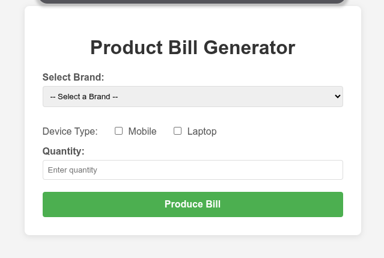
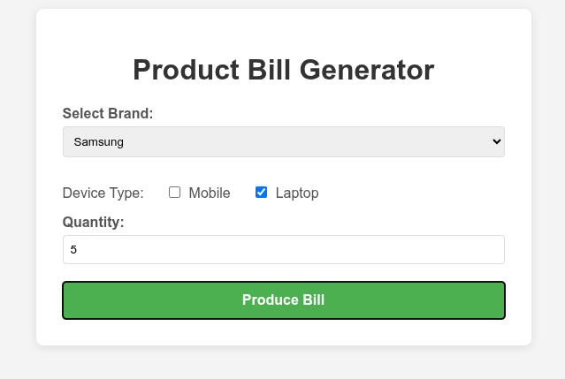
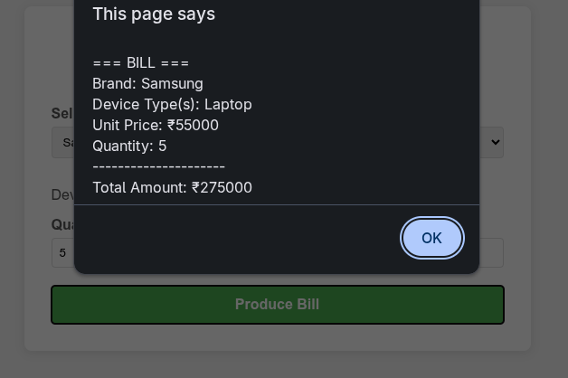
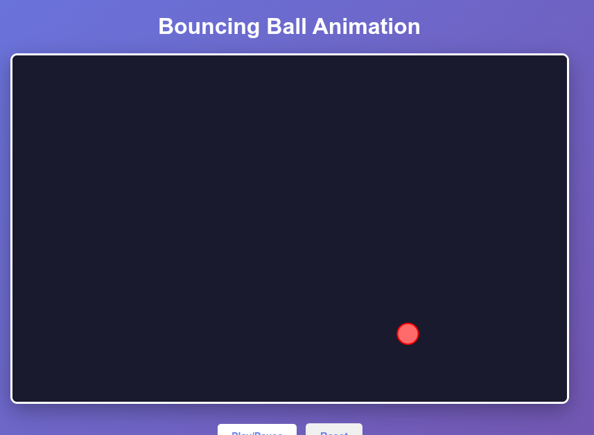
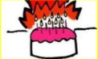
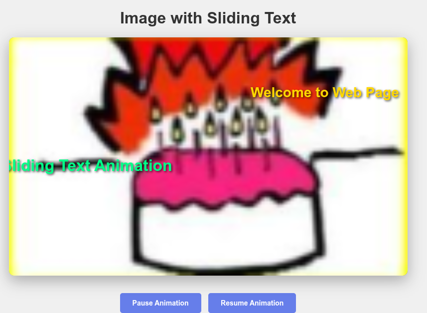

# Lab 2 — JQuery Additional Questions

**Name:** Aditya Sinha<br>
**Reg. No:** 230905218<br>
**Class & Section:** CSE-A1<br>
**Roll No:** 27

---

## Additional Question 1

### Design a webpage. The page contains:  
### a. Dropdown list with HP, Nokia, Samsung, Motorola, Apple as items.  
### b. Checkbox  with  Mobile  and  Laptop  as  items.   Textbox  where  you  enter quantity.  
### c. There is a button with text as ‘Produce Bill’.  
### On Clicking Produce Bill button, alert should be displayed with total amount.
**Code:**

```html
<!DOCTYPE html>
<html>
<head>
    <title>Product Bill Generator</title>
    <style>
        body {
            font-family: Arial, sans-serif;
            margin: 20px;
            background-color: #f4f4f4;
        }
        .container {
            background-color: white;
            padding: 30px;
            border-radius: 8px;
            box-shadow: 0 2px 10px rgba(0, 0, 0, 0.1);
            max-width: 500px;
            margin: 0 auto;
        }
        h1 {
            color: #333;
            text-align: center;
        }
        label {
            display: block;
            margin-top: 15px;
            color: #555;
            font-weight: bold;
        }
        select, input[type="text"], input[type="number"] {
            width: 100%;
            padding: 8px;
            margin-top: 5px;
            border: 1px solid #ddd;
            border-radius: 4px;
            box-sizing: border-box;
        }
        .checkbox-group {
            margin-top: 15px;
        }
        .checkbox-group label {
            display: inline-block;
            margin-right: 20px;
            font-weight: normal;
        }
        input[type="checkbox"] {
            margin-right: 5px;
        }
        button {
            width: 100%;
            padding: 12px;
            margin-top: 20px;
            background-color: #4CAF50;
            color: white;
            border: none;
            border-radius: 4px;
            font-size: 16px;
            font-weight: bold;
            cursor: pointer;
            transition: background-color 0.3s;
        }
        button:hover {
            background-color: #45a049;
        }
    </style>
</head>
<body>
    <div class="container">
        <h1>Product Bill Generator</h1>
        
        <form>
            <label for="brand">Select Brand:</label>
            <select id="brand" name="brand">
                <option value="">-- Select a Brand --</option>
                <option value="HP">HP</option>
                <option value="Nokia">Nokia</option>
                <option value="Samsung">Samsung</option>
                <option value="Motorola">Motorola</option>
                <option value="Apple">Apple</option>
            </select>

            <div class="checkbox-group">
                <label>Device Type:</label>
                <label>
                    <input type="checkbox" name="deviceType" value="Mobile"> Mobile
                </label>
                <label>
                    <input type="checkbox" name="deviceType" value="Laptop"> Laptop
                </label>
            </div>

            <label for="quantity">Quantity:</label>
            <input type="number" id="quantity" name="quantity" min="1" placeholder="Enter quantity">

            <button type="button" onclick="produceBill()">Produce Bill</button>
        </form>
    </div>

    <script>
        const brandPrices = {
            'HP': 45000,
            'Nokia': 25000,
            'Samsung': 55000,
            'Motorola': 35000,
            'Apple': 95000
        };

        function produceBill() {
            const brand = document.getElementById('brand').value;
            const deviceTypes = [];
            const checkboxes = document.querySelectorAll('input[name="deviceType"]:checked');
            checkboxes.forEach(checkbox => {
                deviceTypes.push(checkbox.value);
            });
            const quantity = document.getElementById('quantity').value;

            if (!brand) {
                alert('Please select a brand');
                return;
            }
            if (deviceTypes.length === 0) {
                alert('Please select at least one device type');
                return;
            }
            if (!quantity || quantity <= 0) {
                alert('Please enter a valid quantity');
                return;
            }

            const unitPrice = brandPrices[brand];
            const totalAmount = unitPrice * quantity;

            const bill = `
=== BILL ===
Brand: ${brand}
Device Type(s): ${deviceTypes.join(', ')}
Unit Price: ₹${unitPrice}
Quantity: ${quantity}
---------------------
Total Amount: ₹${totalAmount}
================
            `;

            alert(bill);
        }
    </script>
</body>
</html>
```

**Output:**






---

## Additional Question 2

### Implement the bouncing ball using animate() function.

**Code:**

```html
<!DOCTYPE html>
<html>
<head>
    <title>Bouncing Ball Animation</title>
    <style>
        body {
            font-family: Arial, sans-serif;
            display: flex;
            justify-content: center;
            align-items: center;
            height: 100vh;
            margin: 0;
            background: linear-gradient(135deg, #667eea 0%, #764ba2 100%);
        }
        .container {
            text-align: center;
        }
        h1 {
            color: white;
            margin-bottom: 20px;
        }
        canvas {
            border: 3px solid white;
            background-color: #1a1a2e;
            border-radius: 10px;
            box-shadow: 0 10px 30px rgba(0, 0, 0, 0.3);
        }
        .controls {
            margin-top: 20px;
        }
        button {
            padding: 10px 20px;
            margin: 5px;
            font-size: 14px;
            background-color: white;
            color: #667eea;
            border: none;
            border-radius: 5px;
            cursor: pointer;
            font-weight: bold;
            transition: transform 0.2s;
        }
        button:hover {
            transform: scale(1.05);
            background-color: #f0f0f0;
        }
    </style>
</head>
<body>
    <div class="container">
        <h1>Bouncing Ball Animation</h1>
        <canvas id="canvas" width="800" height="500"></canvas>
        <div class="controls">
            <button onclick="toggleAnimation()">Play/Pause</button>
            <button onclick="resetBall()">Reset</button>
        </div>
    </div>

    <script>
        const canvas = document.getElementById('canvas');
        const ctx = canvas.getContext('2d');

        const ball = {
            x: canvas.width / 2,
            y: canvas.height / 2,
            radius: 15,
            vx: 5,
            vy: 5,
            gravity: 0.3,
            friction: 0.99,
            bounce: 0.8
        };

        let isAnimating = true;

        function drawBall() {
            ctx.beginPath();
            ctx.arc(ball.x, ball.y, ball.radius, 0, Math.PI * 2);
            ctx.fillStyle = '#FF6B6B';
            ctx.fill();
            ctx.strokeStyle = '#FF0000';
            ctx.lineWidth = 2;
            ctx.stroke();
        }

        function updateBall() {
            ball.vy += ball.gravity;
            ball.vx *= ball.friction;
            ball.vy *= ball.friction;
            ball.x += ball.vx;
            ball.y += ball.vy;

            if (ball.x - ball.radius < 0) {
                ball.x = ball.radius;
                ball.vx = -ball.vx * ball.bounce;
            } else if (ball.x + ball.radius > canvas.width) {
                ball.x = canvas.width - ball.radius;
                ball.vx = -ball.vx * ball.bounce;
            }

            if (ball.y - ball.radius < 0) {
                ball.y = ball.radius;
                ball.vy = -ball.vy * ball.bounce;
            } else if (ball.y + ball.radius > canvas.height) {
                ball.y = canvas.height - ball.radius;
                ball.vy = -ball.vy * ball.bounce;
            }
        }

        function animate() {
            ctx.fillStyle = '#1a1a2e';
            ctx.fillRect(0, 0, canvas.width, canvas.height);

            if (isAnimating) {
                updateBall();
            }

            drawBall();
            requestAnimationFrame(animate);
        }

        function toggleAnimation() {
            isAnimating = !isAnimating;
        }

        function resetBall() {
            ball.x = canvas.width / 2;
            ball.y = canvas.height / 2;
            ball.vx = 5;
            ball.vy = 5;
        }

        animate();
    </script>
</body>
</html>
```

**Output:**



---

## Additional Question 3

### Write a web page which displays image and show the sliding text on the image.

**Code:**

```html
<!DOCTYPE html>
<html>
<head>
    <title>Image with Sliding Text</title>
    <style>
        * {
            margin: 0;
            padding: 0;
            box-sizing: border-box;
        }

        body {
            font-family: Arial, sans-serif;
            display: flex;
            justify-content: center;
            align-items: center;
            min-height: 100vh;
            background-color: #f0f0f0;
            padding: 20px;
        }

        .container {
            position: relative;
            width: 100%;
            max-width: 800px;
            overflow: hidden;
            border-radius: 10px;
            box-shadow: 0 10px 30px rgba(0, 0, 0, 0.3);
        }

        .image-wrapper {
            position: relative;
            width: 100%;
            overflow: hidden;
            background: linear-gradient(135deg, #667eea 0%, #764ba2 100%);
        }

        .image-wrapper img {
            width: 100%;
            height: auto;
            display: block;
        }

        .text-overlay {
            position: absolute;
            top: 0;
            left: 0;
            width: 100%;
            height: 100%;
            display: flex;
            align-items: center;
            justify-content: center;
        }

        .sliding-text {
            position: absolute;
            white-space: nowrap;
            font-size: 32px;
            font-weight: bold;
            color: white;
            text-shadow: 2px 2px 4px rgba(0, 0, 0, 0.7);
            animation: slide 8s infinite linear;
        }

        @keyframes slide {
            0% {
                left: -100%;
                opacity: 0;
            }
            10% {
                opacity: 1;
            }
            90% {
                opacity: 1;
            }
            100% {
                left: 100%;
                opacity: 0;
            }
        }

        .sliding-text:nth-child(1) {
            animation-delay: 0s;
            top: 20%;
            font-size: 28px;
            color: #FFD700;
        }

        .sliding-text:nth-child(2) {
            animation-delay: 2.5s;
            top: 50%;
            font-size: 32px;
            color: #00FF88;
        }

        .sliding-text:nth-child(3) {
            animation-delay: 5s;
            top: 80%;
            font-size: 28px;
            color: #FF6B9D;
        }

        .controls {
            text-align: center;
            margin-top: 30px;
        }

        button {
            padding: 12px 25px;
            margin: 5px;
            font-size: 14px;
            background-color: #667eea;
            color: white;
            border: none;
            border-radius: 5px;
            cursor: pointer;
            font-weight: bold;
            transition: transform 0.2s, background-color 0.2s;
        }

        button:hover {
            transform: scale(1.05);
            background-color: #764ba2;
        }

        h1 {
            text-align: center;
            color: #333;
            margin-bottom: 20px;
        }
    </style>
</head>
<body>
    <div style="width: 100%; max-width: 800px;">
        <h1>Image with Sliding Text</h1>
        
        <div class="container">
            <div class="image-wrapper">
                

                <div class="text-overlay">
                    <div class="sliding-text">Welcome to Web Page</div>
                    <div class="sliding-text">Sliding Text Animation</div>
                    <div class="sliding-text">Enjoy the Animation!</div>
                </div>
            </div>
        </div>

        <div class="controls">
            <button onclick="pauseAnimation()">Pause Animation</button>
            <button onclick="resumeAnimation()">Resume Animation</button>
        </div>
    </div>

    <script>
        function pauseAnimation() {
            const textElements = document.querySelectorAll('.sliding-text');
            textElements.forEach(element => {
                element.style.animationPlayState = 'paused';
            });
        }

        function resumeAnimation() {
            const textElements = document.querySelectorAll('.sliding-text');
            textElements.forEach(element => {
                element.style.animationPlayState = 'running';
            });
        }
    </script>
</body>
</html>
```

**Output:**



---
