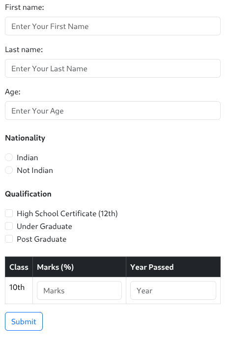
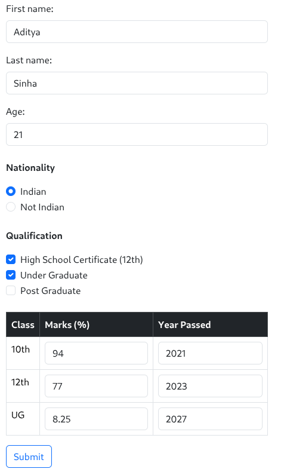
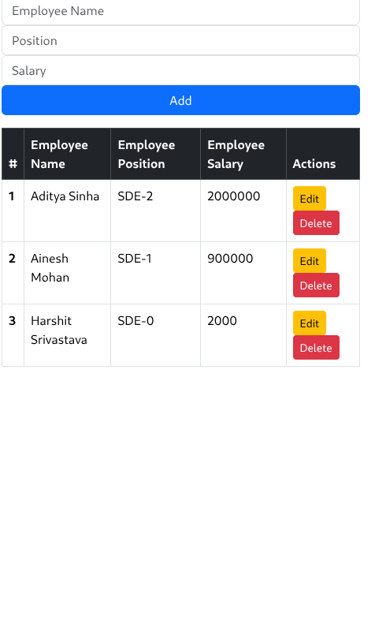
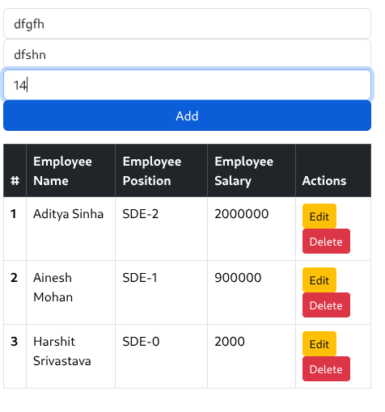
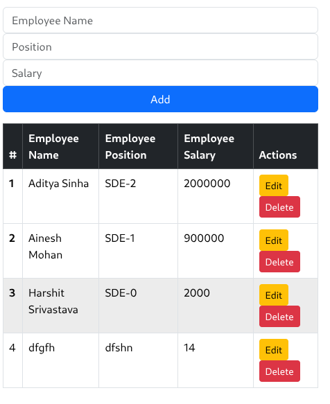
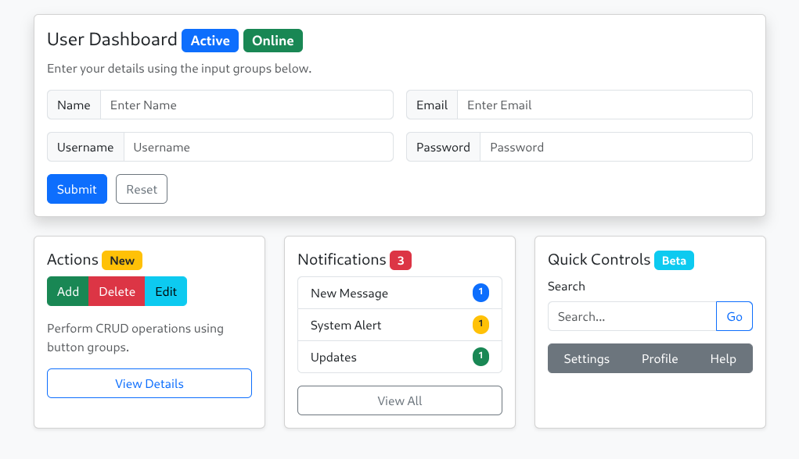
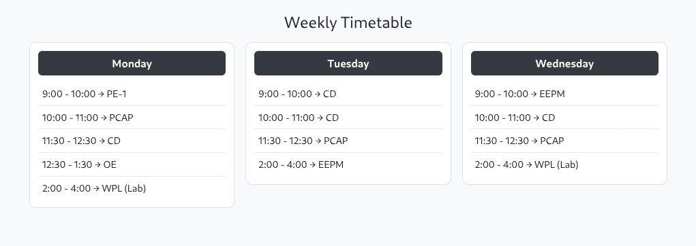

# Lab 3 — Bootstrap

**Name:** Aditya Sinha  
**Reg. No:** 230905218  
**Class & Section:** CSE-A1  
**Roll No:** 27

---

## 1. Design the student bio-data form using button, label, textbox, radio button, table and checkbox.

Code :

```html
<!doctype html>
<html lang="en">
  <head>
    <meta charset="utf-8" />
    <meta name="viewport" content="width=device-width, initial-scale=1" />
    <title>WP Lab — Q3</title>
    <link
      href="https://cdn.jsdelivr.net/npm/bootstrap@5.3.3/dist/css/bootstrap.min.css"
      rel="stylesheet"
    />
    <style>
      :root {
        --accent: #6f42c1;
      }
      body {
        background: linear-gradient(180deg, #f6f8ff 0%, #ffffff 60%);
      }
      .hero {
        background: linear-gradient(
          90deg,
          rgba(111, 66, 193, 0.12),
          rgba(99, 102, 241, 0.06)
        );
        border-radius: 0.75rem;
        padding: 2rem;
      }
      .top-area {
        min-height: 34vh;
        display: flex;
        align-items: center;
      }
      .card-glow {
        box-shadow: 0 8px 20px rgba(99, 102, 241, 0.08);
        border: none;
      }
      .section-head {
        color: var(--accent);
        font-weight: 600;
      }
      .decor-badge {
        background: linear-gradient(90deg, #6f42c1, #7b61ff);
        color: #fff;
      }
      .input-lg {
        height: calc(1.5em + 1rem + 2px);
      }
      @media (max-width: 767px) {
        .top-area {
          padding: 1rem 0;
        }
      }
    </style>
  </head>
  <body>
    <div class="container py-5">
      <!-- Top section -->
      <div class="row mb-4">
        <div class="col-12 hero top-area">
          <div class="w-100">
            <div class="d-flex justify-content-between align-items-start mb-3">
              <div>
                <h2 class="mb-1 section-head">
                  Create with Bootstrap — Top Panel
                </h2>
                <p class="text-muted mb-0">
                  Example using input groups, badges and buttons for a compact
                  search & action area.
                </p>
              </div>
              <div class="text-end">
                <span class="badge decor-badge rounded-pill p-2"
                  >Lab 3 — Q3</span
                >
              </div>
            </div>

            <div class="row g-3 align-items-center">
              <div class="col-md-6">
                <label class="form-label small text-muted">Search</label>
                <div class="input-group input-group-lg">
                  <span class="input-group-text">🔍</span>
                  <input
                    type="text"
                    class="form-control"
                    placeholder="Search projects, files or topics"
                  />
                  <button class="btn btn-outline-primary" type="button">
                    Go
                  </button>
                </div>
              </div>

              <div class="col-md-3">
                <label class="form-label small text-muted">Filter</label>
                <div class="input-group">
                  <select class="form-select">
                    <option selected>All</option>
                    <option>Inputs</option>
                    <option>Buttons</option>
                    <option>Badges</option>
                  </select>
                  <span class="input-group-text"
                    >Items <span class="badge bg-secondary ms-2">34</span></span
                  >
                </div>
              </div>

              <div class="col-md-3 text-md-end">
                <label class="form-label small text-muted d-block"
                  >Actions</label
                >
                <div class="btn-group" role="group">
                  <button class="btn btn-sm btn-outline-secondary">
                    Export
                  </button>
                  <button class="btn btn-sm btn-primary">New</button>
                </div>
              </div>
            </div>
          </div>
        </div>
      </div>

      <!-- Bottom section divided into 3 parts -->
      <div class="row">
        <div class="col-12">
          <div class="row g-4">
            <!-- Left card: Input groups -->
            <div class="col-lg-4">
              <div class="card card-glow p-3 h-100">
                <div class="card-body">
                  <h5 class="card-title">Input Groups</h5>
                  <p class="text-muted small">
                    Different input-group patterns for forms.
                  </p>

                  <div class="mb-3">
                    <label class="form-label">Username</label>
                    <div class="input-group">
                      <span class="input-group-text">@</span>
                      <input
                        type="text"
                        class="form-control"
                        placeholder="username"
                      />
                    </div>
                  </div>

                  <div class="mb-3">
                    <label class="form-label">Amount</label>
                    <div class="input-group">
                      <input type="number" class="form-control" />
                      <span class="input-group-text">.00</span>
                      <button class="btn btn-outline-success">Pay</button>
                    </div>
                  </div>

                  <div>
                    <label class="form-label">Search with tags</label>
                    <div class="input-group">
                      <input
                        class="form-control"
                        type="search"
                        placeholder="search tags..."
                      />
                      <button class="btn btn-outline-secondary">Add</button>
                    </div>
                    <div class="mt-2">
                      <span class="badge bg-info me-1">HTML</span>
                      <span class="badge bg-warning text-dark me-1">CSS</span>
                      <span class="badge bg-success">Bootstrap</span>
                    </div>
                  </div>
                </div>
              </div>
            </div>

            <!-- Middle card: Buttons & groups -->
            <div class="col-lg-4">
              <div class="card card-glow p-3 h-100">
                <div class="card-body">
                  <h5 class="card-title">Buttons & Groups</h5>
                  <p class="text-muted small">
                    Useful action groups and badge counters.
                  </p>

                  <div class="mb-3">
                    <div class="btn-toolbar" role="toolbar">
                      <div class="btn-group me-2" role="group">
                        <button class="btn btn-outline-primary">Left</button>
                        <button class="btn btn-primary">Middle</button>
                        <button class="btn btn-outline-primary">Right</button>
                      </div>
                      <div class="btn-group" role="group">
                        <button class="btn btn-outline-secondary">Edit</button>
                        <button class="btn btn-outline-secondary">
                          Delete
                        </button>
                      </div>
                    </div>
                  </div>

                  <div class="mb-3">
                    <label class="form-label">Stateful Buttons</label>
                    <div class="d-flex gap-2">
                      <button class="btn btn-sm btn-success">
                        Accept
                        <span class="badge bg-white text-success ms-2">4</span>
                      </button>
                      <button class="btn btn-sm btn-danger">
                        Reject
                        <span class="badge bg-white text-danger ms-2">1</span>
                      </button>
                      <button class="btn btn-sm btn-outline-secondary">
                        Maybe
                      </button>
                    </div>
                  </div>

                  <div>
                    <label class="form-label">Split action</label>
                    <div class="btn-group">
                      <button class="btn btn-primary">Action</button>
                      <button
                        type="button"
                        class="btn btn-primary dropdown-toggle dropdown-toggle-split"
                        data-bs-toggle="dropdown"
                      ></button>
                      <ul class="dropdown-menu">
                        <li><a class="dropdown-item" href="#">Option 1</a></li>
                        <li><a class="dropdown-item" href="#">Option 2</a></li>
                      </ul>
                    </div>
                  </div>
                </div>
              </div>
            </div>

            <!-- Right card: Forms + badges -->
            <div class="col-lg-4">
              <div class="card card-glow p-3 h-100">
                <div class="card-body">
                  <h5 class="card-title">Compact Form</h5>
                  <p class="text-muted small">
                    Combines inputs, badges and micro-actions.
                  </p>

                  <form class="mb-3">
                    <div class="mb-2">
                      <label class="form-label small">Email</label>
                      <div class="input-group">
                        <input
                          type="email"
                          class="form-control"
                          placeholder="name@example.com"
                        />
                        <span class="input-group-text">@mail</span>
                      </div>
                    </div>

                    <div class="mb-2">
                      <label class="form-label small">Notify</label>
                      <div class="d-flex align-items-center gap-2">
                        <div class="form-check form-switch">
                          <input
                            class="form-check-input"
                            type="checkbox"
                            id="switchNotify"
                            checked
                          />
                          <label
                            class="form-check-label small"
                            for="switchNotify"
                            >on</label
                          >
                        </div>
                        <span class="badge bg-primary">Realtime</span>
                      </div>
                    </div>

                    <div
                      class="mt-3 d-flex justify-content-between align-items-center"
                    >
                      <div>
                        <small class="text-muted">Status</small>
                        <div>
                          <span class="badge bg-success">Active</span>
                          <span class="badge bg-light text-muted">Beta</span>
                        </div>
                      </div>
                      <div>
                        <button class="btn btn-outline-primary">Save</button>
                        <button class="btn btn-outline-danger ms-2">
                          Cancel
                        </button>
                      </div>
                    </div>
                  </form>
                </div>
              </div>
            </div>
          </div>
        </div>
      </div>
    </div>

    <script src="https://cdn.jsdelivr.net/npm/bootstrap@5.3.3/dist/js/bootstrap.bundle.min.js"></script>
  </body>
</html>
```

- 
- 

---

## 2. Design a web page which shows the database-oriented CRUD operation. Consider Employee data.

Code :

```html
<!doctype html>
<html lang="en">
  <head>
    <title>Bootstrap Program 2</title>
    <meta charset="utf-8" />
    <meta name="viewport" content="width=device-width, initial-scale=1" />

    <link
      href="https://cdn.jsdelivr.net/npm/bootstrap@5.3.2/dist/css/bootstrap.min.css"
      rel="stylesheet"
      integrity="sha384-T3c6CoIi6uLrA9TneNEoa7RxnatzjcDSCmG1MXxSR1GAsXEV/Dwwykc2MPK8M2HN"
      crossorigin="anonymous"
    />

    <script src="q2.js" defer></script>
  </head>

  <body class="p-3">
    <div class="container">
      <!-- Add Employee Form -->
      <div class="row mb-3">
        <div class="col-md-3">
          <input
            id="empName"
            class="form-control"
            placeholder="Employee Name"
          />
        </div>
        <div class="col-md-3">
          <input id="empPos" class="form-control" placeholder="Position" />
        </div>
        <div class="col-md-3">
          <input id="empSalary" class="form-control" placeholder="Salary" />
        </div>
        <div class="col-md-3">
          <button class="btn btn-primary w-100" onclick="addRow()">Add</button>
        </div>
      </div>

      <!-- Table -->
      <table class="table table-bordered table-hover" id="empTable">
        <thead class="table-dark">
          <tr>
            <th>#</th>
            <th>Employee Name</th>
            <th>Employee Position</th>
            <th>Employee Salary</th>
            <th>Actions</th>
          </tr>
        </thead>
        <tbody>
          <tr>
            <th>1</th>
            <td>Aditya Sinha</td>
            <td>SDE-2</td>
            <td>2000000</td>
            <td>
              <button class="btn btn-sm btn-warning" onclick="editRow(this)">
                Edit
              </button>
              <button class="btn btn-sm btn-danger" onclick="deleteRow(this)">
                Delete
              </button>
            </td>
          </tr>
          <tr>
            <th>2</th>
            <td>Ainesh Mohan</td>
            <td>SDE-1</td>
            <td>900000</td>
            <td>
              <button class="btn btn-sm btn-warning" onclick="editRow(this)">
                Edit
              </button>
              <button class="btn btn-sm btn-danger" onclick="deleteRow(this)">
                Delete
              </button>
            </td>
          </tr>
          <tr>
            <th>3</th>
            <td>Harshit Srivastava</td>
            <td>SDE-0</td>
            <td>2000</td>
            <td>
              <button class="btn btn-sm btn-warning" onclick="editRow(this)">
                Edit
              </button>
              <button class="btn btn-sm btn-danger" onclick="deleteRow(this)">
                Delete
              </button>
            </td>
          </tr>
        </tbody>
      </table>
    </div>
  </body>
</html>
```

```js
let editTarget = null;

function addRow() {
  const name = document.getElementById("empName").value.trim();
  const pos = document.getElementById("empPos").value.trim();
  const salary = document.getElementById("empSalary").value.trim();

  if (!name || !pos || !salary) {
    alert("All fields are required.");
    return;
  }

  const table = document.getElementById("empTable").querySelector("tbody");
  const rowCount = table.rows.length + 1;

  const row = table.insertRow();

  const cellIndex = row.insertCell(0);
  const cellName = row.insertCell(1);
  const cellPos = row.insertCell(2);
  const cellSalary = row.insertCell(3);
  const cellActions = row.insertCell(4);

  cellIndex.innerHTML = rowCount;
  cellName.innerHTML = name;
  cellPos.innerHTML = pos;
  cellSalary.innerHTML = salary;
  cellActions.innerHTML = `
    <button class="btn btn-sm btn-warning" onclick="editRow(this)">Edit</button>
    <button class="btn btn-sm btn-danger" onclick="deleteRow(this)">Delete</button>
  `;

  clearInputs();
}

function editRow(btn) {
  const row = btn.closest("tr");

  if (editTarget === row) return;

  editTarget = row;

  const name = row.cells[1].innerText;
  const pos = row.cells[2].innerText;
  const salary = row.cells[3].innerText;

  document.getElementById("empName").value = name;
  document.getElementById("empPos").value = pos;
  document.getElementById("empSalary").value = salary;

  const addBtn = document.querySelector("button[onclick='addRow()']");
  addBtn.innerText = "Update";
  addBtn.classList.replace("btn-primary", "btn-success");
  addBtn.setAttribute("onclick", "updateRow()");
}

function updateRow() {
  if (!editTarget) return;

  const name = document.getElementById("empName").value.trim();
  const pos = document.getElementById("empPos").value.trim();
  const salary = document.getElementById("empSalary").value.trim();

  if (!name || !pos || !salary) {
    alert("All fields are required.");
    return;
  }

  editTarget.cells[1].innerText = name;
  editTarget.cells[2].innerText = pos;
  editTarget.cells[3].innerText = salary;

  resetForm();
}

function deleteRow(btn) {
  const row = btn.closest("tr");
  row.remove();
  renumberRows();
}

function renumberRows() {
  const rows = document.getElementById("empTable").querySelector("tbody").rows;

  for (let i = 0; i < rows.length; i++) {
    rows[i].cells[0].innerText = i + 1;
  }
}

function clearInputs() {
  document.getElementById("empName").value = "";
  document.getElementById("empPos").value = "";
  document.getElementById("empSalary").value = "";
}

function resetForm() {
  clearInputs();

  editTarget = null;

  const addBtn = document.querySelector("button[onclick='updateRow()']");
  addBtn.innerText = "Add";
  addBtn.classList.replace("btn-success", "btn-primary");
  addBtn.setAttribute("onclick", "addRow()");
}
```





---

## 3. Create a web page using bootstrap as mentioned. Divide the page into 2 parts top and bottom, then divide the bottom into 3 parts and design each top and bottom part using different input groups, input, badges, buttons and button groups. Make the design more attractive.

Code :

```html
<!doctype html>
<html lang="en">
  <head>
    <meta charset="utf-8" />
    <meta name="viewport" content="width=device-width, initial-scale=1" />
    <title>Bootstrap Layout Program</title>

    <link
      href="https://cdn.jsdelivr.net/npm/bootstrap@5.3.2/dist/css/bootstrap.min.css"
      rel="stylesheet"
    />

    <script
      src="https://cdn.jsdelivr.net/npm/bootstrap@5.3.2/dist/js/bootstrap.bundle.min.js"
      defer
    ></script>
  </head>

  <body class="bg-light">
    <div class="container py-4">
      <!-- TOP SECTION -->
      <div class="card mb-4 shadow">
        <div class="card-body">
          <h4 class="card-title">
            User Dashboard
            <span class="badge bg-primary">Active</span>
            <span class="badge bg-success">Online</span>
          </h4>

          <p class="text-muted">
            Enter your details using the input groups below.
          </p>

          <div class="row g-3">
            <div class="col-md-6">
              <div class="input-group">
                <span class="input-group-text">Name</span>
                <input
                  type="text"
                  class="form-control"
                  placeholder="Enter Name"
                />
              </div>
            </div>

            <div class="col-md-6">
              <div class="input-group">
                <span class="input-group-text">Email</span>
                <input
                  type="email"
                  class="form-control"
                  placeholder="Enter Email"
                />
              </div>
            </div>

            <div class="col-md-6">
              <div class="input-group">
                <span class="input-group-text">Username</span>
                <input
                  type="text"
                  class="form-control"
                  placeholder="Username"
                />
              </div>
            </div>

            <div class="col-md-6">
              <div class="input-group">
                <span class="input-group-text">Password</span>
                <input
                  type="password"
                  class="form-control"
                  placeholder="Password"
                />
              </div>
            </div>
          </div>

          <div class="mt-3">
            <button class="btn btn-primary me-2">Submit</button>
            <button class="btn btn-outline-secondary">Reset</button>
          </div>
        </div>
      </div>

      <!-- BOTTOM SECTION -->
      <div class="row g-4">
        <!-- Bottom Part 1 -->
        <div class="col-md-4">
          <div class="card h-100 shadow-sm">
            <div class="card-body">
              <h5 class="card-title">
                Actions
                <span class="badge bg-warning text-dark">New</span>
              </h5>

              <div class="btn-group mb-3">
                <button class="btn btn-success">Add</button>
                <button class="btn btn-danger">Delete</button>
                <button class="btn btn-info">Edit</button>
              </div>

              <p class="text-muted">
                Perform CRUD operations using button groups.
              </p>

              <button class="btn btn-outline-primary w-100">
                View Details
              </button>
            </div>
          </div>
        </div>

        <!-- Bottom Part 2 -->
        <div class="col-md-4">
          <div class="card h-100 shadow-sm">
            <div class="card-body">
              <h5 class="card-title">
                Notifications
                <span class="badge bg-danger">3</span>
              </h5>

              <ul class="list-group mb-3">
                <li class="list-group-item d-flex justify-content-between">
                  New Message
                  <span class="badge bg-primary rounded-pill">1</span>
                </li>
                <li class="list-group-item d-flex justify-content-between">
                  System Alert
                  <span class="badge bg-warning text-dark rounded-pill">1</span>
                </li>
                <li class="list-group-item d-flex justify-content-between">
                  Updates
                  <span class="badge bg-success rounded-pill">1</span>
                </li>
              </ul>

              <button class="btn btn-outline-secondary w-100">View All</button>
            </div>
          </div>
        </div>

        <!-- Bottom Part 3 -->
        <div class="col-md-4">
          <div class="card h-100 shadow-sm">
            <div class="card-body">
              <h5 class="card-title">
                Quick Controls
                <span class="badge bg-info">Beta</span>
              </h5>

              <div class="mb-3">
                <label class="form-label">Search</label>
                <div class="input-group">
                  <input
                    type="text"
                    class="form-control"
                    placeholder="Search..."
                  />
                  <button class="btn btn-outline-primary">Go</button>
                </div>
              </div>

              <div class="btn-group w-100">
                <button class="btn btn-secondary">Settings</button>
                <button class="btn btn-secondary">Profile</button>
                <button class="btn btn-secondary">Help</button>
              </div>
            </div>
          </div>
        </div>
      </div>
    </div>
  </body>
</html>
```



## 4. Design your class timetable using bootstrap table and carousel.

Code :

```html
<!doctype html>
<html lang="en">
  <head>
    <meta charset="utf-8" />
    <meta name="viewport" content="width=device-width, initial-scale=1" />
    <title>Timetable Carousel</title>

    <link
      href="https://cdn.jsdelivr.net/npm/bootstrap@5.3.2/dist/css/bootstrap.min.css"
      rel="stylesheet"
    />

    <script
      src="https://cdn.jsdelivr.net/npm/bootstrap@5.3.2/dist/js/bootstrap.bundle.min.js"
      defer
    ></script>

    <style>
      .day-card {
        border: 1px solid #dee2e6;
        border-radius: 10px;
        padding: 12px;
        background: #fff;
      }

      .day-title {
        font-weight: 600;
        text-align: center;
        background: #343a40;
        color: #fff;
        border-radius: 6px;
        padding: 6px;
        margin-bottom: 10px;
      }

      .period {
        font-size: 0.9rem;
        padding: 6px;
        border-bottom: 1px solid #e9ecef;
      }

      .period:last-child {
        border-bottom: none;
      }
    </style>
  </head>

  <body class="bg-light p-4">
    <div class="container">
      <h4 class="mb-3 text-center">Weekly Timetable</h4>

      <div id="timetableCarousel" class="carousel slide" data-bs-ride="false">
        <div class="carousel-inner">
          <!-- Slide 1: Mon - Wed -->
          <div class="carousel-item active">
            <div class="row g-3">
              <div class="col-md-4">
                <div class="day-card">
                  <div class="day-title">Monday</div>
                  <div class="period">9:00 - 10:00 → PE-1</div>
                  <div class="period">10:00 - 11:00 → PCAP</div>
                  <div class="period">11:30 - 12:30 → CD</div>
                  <div class="period">12:30 - 1:30 → OE</div>
                  <div class="period">2:00 - 4:00 → WPL (Lab)</div>
                </div>
              </div>

              <div class="col-md-4">
                <div class="day-card">
                  <div class="day-title">Tuesday</div>
                  <div class="period">9:00 - 10:00 → CD</div>
                  <div class="period">10:00 - 11:00 → CD</div>
                  <div class="period">11:30 - 12:30 → PCAP</div>
                  <div class="period">2:00 - 4:00 → EEPM</div>
                </div>
              </div>

              <div class="col-md-4">
                <div class="day-card">
                  <div class="day-title">Wednesday</div>
                  <div class="period">9:00 - 10:00 → EEPM</div>
                  <div class="period">10:00 - 11:00 → CD</div>
                  <div class="period">11:30 - 12:30 → PCAP</div>
                  <div class="period">2:00 - 4:00 → WPL (Lab)</div>
                </div>
              </div>
            </div>
          </div>

          <!-- Slide 2: Thu - Sat -->
          <div class="carousel-item">
            <div class="row g-3">
              <div class="col-md-4">
                <div class="day-card">
                  <div class="day-title">Thursday</div>
                  <div class="period">9:00 - 10:00 → PPL</div>
                  <div class="period">10:00 - 11:00 → ASE</div>
                  <div class="period">11:30 - 12:30 → CD</div>
                  <div class="period">2:00 - 4:00 → OE</div>
                </div>
              </div>

              <div class="col-md-4">
                <div class="day-card">
                  <div class="day-title">Friday</div>
                  <div class="period">9:00 - 10:00 → CD</div>
                  <div class="period">10:00 - 11:00 → OE</div>
                  <div class="period">11:30 - 12:30 → PE-2</div>
                  <div class="period">12:30 - 1:30 → EEPM</div>
                </div>
              </div>

              <div class="col-md-4">
                <div class="day-card">
                  <div class="day-title">Saturday</div>
                  <div class="period">1:00 - 2:00 → PE-1</div>
                  <div class="period">2:00 - 4:00 → PCAP</div>
                </div>
              </div>
            </div>
          </div>
        </div>

        <!-- Controls -->
        <button
          class="carousel-control-prev"
          type="button"
          data-bs-target="#timetableCarousel"
          data-bs-slide="prev"
        >
          <span class="carousel-control-prev-icon"></span>
        </button>

        <button
          class="carousel-control-next"
          type="button"
          data-bs-target="#timetableCarousel"
          data-bs-slide="next"
        >
          <span class="carousel-control-next-icon"></span>
        </button>
      </div>
    </div>
  </body>
</html>
```


