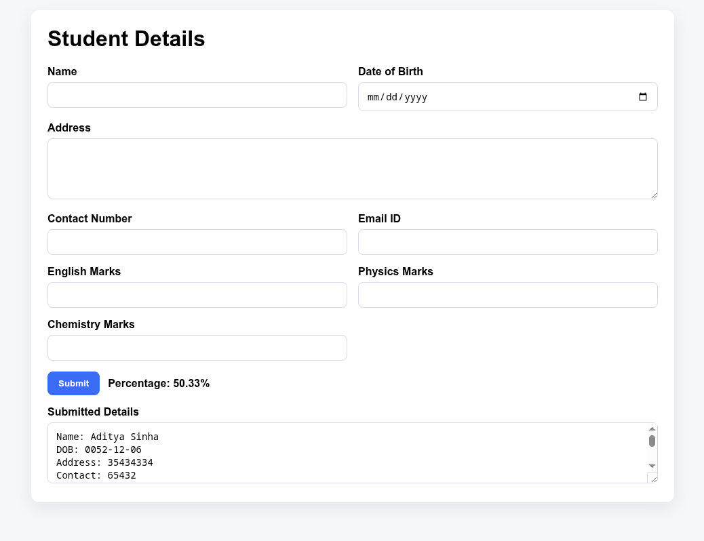

# Lab 5 — Developing Web Application using Django-Part I

**Name:** Aditya Sinha  
**Reg. No:** 230905218  
**Class & Section:** CSE-A1  
**Roll No:** 27

---

## 1. Student Details Form

**Description:** Create a form to enter student details and marks. On submit, append details to a textarea and show total percentage.

**Code (View):**
```python
from django.shortcuts import render


def index(request):
	return render(request, 'q1_form.html')
```

**Code (URL config):**
```python
from django.urls import path
from . import views

urlpatterns = [
    path('', views.index, name='index'),
]
```

**Code (Template):**
```html
<!DOCTYPE html>
<html lang="en">
<head>
    <meta charset="UTF-8" />
    <meta name="viewport" content="width=device-width, initial-scale=1.0" />
    <title>Student Details Form</title>
    <style>
        body {
            font-family: Arial, sans-serif;
            background: #f5f7fb;
            margin: 0;
            padding: 24px;
        }
        .container {
            max-width: 900px;
            margin: 0 auto;
            background: #ffffff;
            border-radius: 12px;
            padding: 24px;
            box-shadow: 0 8px 24px rgba(0, 0, 0, 0.08);
        }
        h1 {
            margin-top: 0;
        }
        .grid {
            display: grid;
            grid-template-columns: repeat(2, 1fr);
            gap: 16px;
        }
        label {
            font-weight: 600;
            display: block;
            margin-bottom: 6px;
        }
        input, textarea {
            width: 100%;
            padding: 10px 12px;
            border: 1px solid #d7dbe7;
            border-radius: 8px;
            font-size: 14px;
            box-sizing: border-box;
        }
        textarea {
            min-height: 90px;
            resize: vertical;
        }
        .full {
            grid-column: 1 / -1;
        }
        .actions {
            margin-top: 16px;
            display: flex;
            gap: 12px;
            align-items: center;
        }
        button {
            background: #3a6cf4;
            color: #fff;
            border: 0;
            padding: 10px 16px;
            border-radius: 8px;
            font-weight: 600;
            cursor: pointer;
        }
        .label {
            font-weight: 700;
        }
        .result {
            margin-top: 16px;
        }
    </style>
</head>
<body>
    <div class="container">
        <h1>Student Details</h1>
        <form id="studentForm">
            <div class="grid">
                <div>
                    <label for="studentName">Name</label>
                    <input id="studentName" type="text" required />
                </div>
                <div>
                    <label for="dob">Date of Birth</label>
                    <input id="dob" type="date" required />
                </div>
                <div class="full">
                    <label for="address">Address</label>
                    <textarea id="address" required></textarea>
                </div>
                <div>
                    <label for="contact">Contact Number</label>
                    <input id="contact" type="tel" required />
                </div>
                <div>
                    <label for="email">Email ID</label>
                    <input id="email" type="email" required />
                </div>
                <div>
                    <label for="english">English Marks</label>
                    <input id="english" type="number" min="0" max="100" required />
                </div>
                <div>
                    <label for="physics">Physics Marks</label>
                    <input id="physics" type="number" min="0" max="100" required />
                </div>
                <div>
                    <label for="chemistry">Chemistry Marks</label>
                    <input id="chemistry" type="number" min="0" max="100" required />
                </div>
            </div>
            <div class="actions">
                <button type="submit">Submit</button>
                <span class="label">Percentage: <span id="percentage">0</span>%</span>
            </div>
            <div class="result">
                <label for="details">Submitted Details</label>
                <textarea id="details" readonly></textarea>
            </div>
        </form>
    </div>

    <script>
        const form = document.getElementById('studentForm');
        const detailsBox = document.getElementById('details');
        const percentageLabel = document.getElementById('percentage');

        form.addEventListener('submit', (event) => {
            event.preventDefault();

            const name = document.getElementById('studentName').value.trim();
            const dob = document.getElementById('dob').value;
            const address = document.getElementById('address').value.trim();
            const contact = document.getElementById('contact').value.trim();
            const email = document.getElementById('email').value.trim();
            const english = Number(document.getElementById('english').value);
            const physics = Number(document.getElementById('physics').value);
            const chemistry = Number(document.getElementById('chemistry').value);

            const total = english + physics + chemistry;
            const percentage = (total / 3).toFixed(2);
            percentageLabel.textContent = percentage;

            const block = [
                `Name: ${name}`,
                `DOB: ${dob}`,
                `Address: ${address}`,
                `Contact: ${contact}`,
                `Email: ${email}`,
                `English: ${english}`,
                `Physics: ${physics}`,
                `Chemistry: ${chemistry}`,
                `Percentage: ${percentage}%`,
                '------------------------',
            ].join('\n');

            form.reset();
            detailsBox.value = detailsBox.value ? `${detailsBox.value}\n${block}` : block;
        });
    </script>
</body>
</html>
```

**Output:**



---

## 2. Promotion Eligibility Form

**Description:** Choose an employee ID and enter the date of joining. Show YES if experience is 5+ years; otherwise NO.

**Code (View):**
```python
from django.shortcuts import render


def index(request):
	return render(request, 'q2_promo.html')
```

**Code (URL config):**
```python
from django.urls import path
from . import views

urlpatterns = [
    path('', views.index, name='index'),
]
```

**Code (Template):**
```html
<!DOCTYPE html>
<html lang="en">
<head>
    <meta charset="UTF-8" />
    <meta name="viewport" content="width=device-width, initial-scale=1.0" />
    <title>Promotion Eligibility</title>
    <style>
        body {
            font-family: Arial, sans-serif;
            background: #f7f8fc;
            margin: 0;
            padding: 24px;
        }
        .card {
            max-width: 640px;
            margin: 0 auto;
            background: #ffffff;
            border-radius: 12px;
            padding: 24px;
            box-shadow: 0 8px 24px rgba(0, 0, 0, 0.08);
        }
        label {
            font-weight: 600;
            display: block;
            margin-bottom: 6px;
        }
        select, input {
            width: 100%;
            padding: 10px 12px;
            border: 1px solid #d7dbe7;
            border-radius: 8px;
            font-size: 14px;
            box-sizing: border-box;
            margin-bottom: 14px;
        }
        button {
            background: #2f7d32;
            color: #fff;
            border: 0;
            padding: 10px 16px;
            border-radius: 8px;
            font-weight: 600;
            cursor: pointer;
        }
        .result {
            margin-top: 16px;
            font-size: 18px;
            font-weight: 700;
        }
    </style>
</head>
<body>
    <div class="card">
        <h1>Promotion Eligibility</h1>
        <form id="promoForm">
            <label for="employeeId">Employee ID</label>
            <select id="employeeId" required>
                <option value="">Select ID</option>
                <option value="EMP001">EMP001</option>
                <option value="EMP002">EMP002</option>
                <option value="EMP003">EMP003</option>
                <option value="EMP004">EMP004</option>
            </select>

            <label for="doj">Date of Joining</label>
            <input id="doj" type="date" required />

            <button type="submit">Am I Eligible for Promotion</button>
            <div class="result">Eligibility: <span id="eligibility">-</span></div>
        </form>
    </div>

    <script>
        const form = document.getElementById('promoForm');
        const eligibilityLabel = document.getElementById('eligibility');

        form.addEventListener('submit', (event) => {
            event.preventDefault();

            const dojValue = document.getElementById('doj').value;
            if (!dojValue) {
                eligibilityLabel.textContent = '-';
                return;
            }

            const doj = new Date(dojValue);
            const now = new Date();
            const years = (now - doj) / (1000 * 60 * 60 * 24 * 365.25);

            eligibilityLabel.textContent = years >= 5 ? 'YES' : 'NO';
        });
    </script>
</body>
</html>
```

**Output:**


