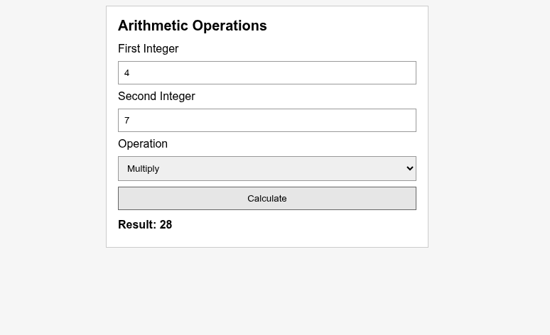
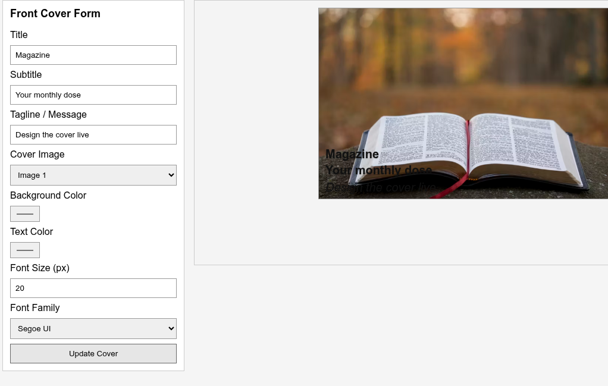
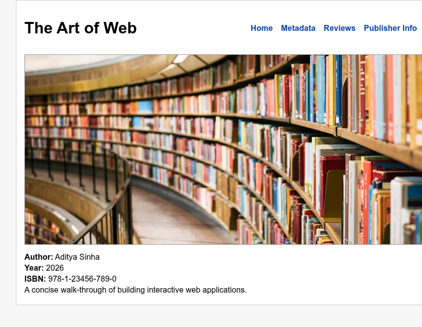

# Lab 5 — Developing Web Application using Django-Part II

**Name:** Aditya Sinha  
**Reg. No:** 230905218  
**Class & Section:** CSE-A1  
**Roll No:** 27

---

## Q1 — Basic Arithmetic Page
**Description:** Take two integers, choose an operation (add, subtract, multiply, divide), and display the result on the same page. Input validation prevents non-integers; division by zero is handled.

**Code (View):**
```python
from django.shortcuts import render


def index(request):
    result = None
    error = None
    a = ""
    b = ""
    op = "add"

    if request.method == "POST":
        a = request.POST.get("a", "").strip()
        b = request.POST.get("b", "").strip()
        op = request.POST.get("operation", "add")
        try:
            a_val = int(a)
            b_val = int(b)
            if op == "add":
                result = a_val + b_val
            elif op == "sub":
                result = a_val - b_val
            elif op == "mul":
                result = a_val * b_val
            elif op == "div":
                if b_val == 0:
                    error = "Cannot divide by zero."
                else:
                    result = a_val / b_val
        except ValueError:
            error = "Please enter valid integers."

    return render(
        request,
        "q1_index.html",
        {"result": result, "error": error, "a": a, "b": b, "op": op},
    )
```

**Code (URL config):**
```python
from django.urls import path
from . import views

urlpatterns = [
    path("", views.index, name="index"),
]
```

**Code (Template):**
```html
<form method="post">
    
    <label>First Integer</label>
    <input type="text" name="a" value="{{ a }}" />

    <label>Second Integer</label>
    <input type="text" name="b" value="{{ b }}" />

    <label>Operation</label>
    <select name="operation">
        <option value="add" selected>Add</option>
        <option value="sub" selected>Subtract</option>
        <option value="mul" selected>Multiply</option>
        <option value="div" selected>Divide</option>
    </select>

    <button type="submit">Calculate</button>
</form>
<div class="output">
    <div class="error">{{ error }}</div><div class="result">Result: {{ result }}</div>
</div>
```

**Output:**


---

## Q2 — Magazine Cover Builder
**Description:** Form-driven cover builder: choose image, background color, text color, font family/size, and title/subtitle/tagline; updates preview on submit.

**Code (View):**
```python
from django.shortcuts import render

DEFAULT_IMAGE = "https://images.unsplash.com/photo-1509021436665-8f07dbf5bf1d?auto=format&fit=crop&w=800&q=60"
ALT_IMAGE_1 = "https://images.unsplash.com/photo-1521572267360-ee0c2909d518?auto=format&fit=crop&w=800&q=60"
ALT_IMAGE_2 = "https://images.unsplash.com/photo-1507842217343-583bb7270b66?auto=format&fit=crop&w=800&q=60"


def index(request):
    title = "Magazine"
    subtitle = "Your monthly dose"
    tagline = "Design the cover live"
    cover_image = DEFAULT_IMAGE
    bg_color = "#f4f4f4"
    text_color = "#111111"
    font_size = "20"
    font_family = "'Segoe UI', Arial, sans-serif"

    if request.method == "POST":
        title = request.POST.get("title", title)
        subtitle = request.POST.get("subtitle", subtitle)
        tagline = request.POST.get("tagline", tagline)
        cover_image = request.POST.get("cover_image", cover_image)
        bg_color = request.POST.get("bg_color", bg_color)
        text_color = request.POST.get("text_color", text_color)
        font_size = request.POST.get("font_size", font_size)
        font_family = request.POST.get("font_family", font_family)

    context = {
        "title": title,
        "subtitle": subtitle,
        "tagline": tagline,
        "cover_image": cover_image,
        "bg_color": bg_color,
        "text_color": text_color,
        "font_size": font_size,
        "font_family": font_family,
        "images": [DEFAULT_IMAGE, ALT_IMAGE_1, ALT_IMAGE_2],
    }
    return render(request, "q2_index.html", context)
```

**Code (URL config):**
```python
from django.urls import path
from . import views

urlpatterns = [
    path("", views.index, name="index"),
]
```

**Code (Template):**
```html
<form method="post" class="panel">
    
    <label>Title</label>
    <input type="text" name="title" value="{{ title }}" />
    <!-- subtitle, tagline, image selector, colors, font size/family -->
    <button type="submit">Update Cover</button>
</form>
<div class="preview" style="background: {{ bg_color }}; font-family: {{ font_family }}; color: {{ text_color }};">
    <div class="cover">
        
        <div class="text" style="font-size: {{ font_size }}px;">
            <div class="title">{{ title }}</div>
            <div class="subtitle">{{ subtitle }}</div>
            <div class="tagline">{{ tagline }}</div>
        </div>
    </div>
</div>
```

**Output:**


---

## Q3 — Book Information App
**Description:** Single-page app with tabs (via query param `page`) for Home, Metadata, Reviews, and Publisher info. Home shows cover, summary, and key details; other tabs show list data and include back links.

**Code (View):**
```python
from django.shortcuts import render

BOOK = {
    "title": "The Art of Web",
    "author": "Aditya Sinha",
    "year": "2026",
    "publisher": "Campus Press",
    "isbn": "978-1-23456-789-0",
    "cover": "https://images.unsplash.com/photo-1524995997946-a1c2e315a42f?auto=format&fit=crop&w=800&q=60",
    "summary": "A concise walk-through of building interactive web applications.",
    "reviews": [
        "Clear and practical guide for students.",
        "Great examples and easy to follow.",
        "Perfect quick reference for labs.",
    ],
}


def index(request):
    page = request.GET.get("page", "home")
    context = {"book": BOOK, "page": page}
    return render(request, "q3_index.html", context)
```

**Code (URL config):**
```python
from django.urls import path
from . import views

urlpatterns = [
    path("", views.index, name="index"),
]
```

**Code (Template):**
```html
<nav>
    <a href="/?page=home">Home</a>
    <a href="/?page=metadata">Metadata</a>
    <a href="/?page=reviews">Reviews</a>
    <a href="/?page=publisher">Publisher Info</a>
</nav>

    <!-- cover, summary -->

    <!-- list metadata -->

    <!-- list reviews -->

    <!-- publisher info -->

```

**Output:**

