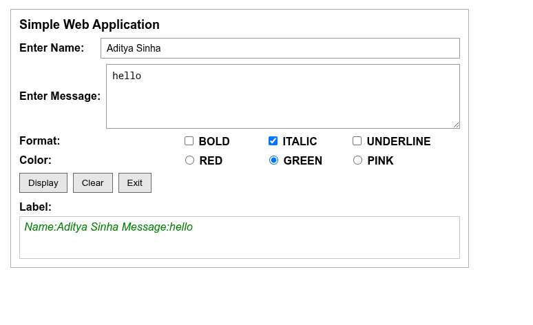

# Lab 5 — Developing Web Application using Django-Part II Homework

**Name:** Aditya Sinha  
**Reg. No:** 230905218  
**Class & Section:** CSE-A1  
**Roll No:** 27

---

## Label Formatter Page (Lab 6 / A1)

**Description:** Collect name and message, concatenate into a label, allow bold/italic/underline and color (red/green/pink), and provide Display, Clear, and Exit actions. Clear resets inputs and formatting; Exit disables inputs and shows an exited notice.

**Code (View):**
```python
from django.shortcuts import render


def index(request):
    name = ""
    message = ""
    bold = False
    italic = False
    underline = False
    color = "red"
    label_text = ""
    exited = False

    if request.method == "POST":
        action = request.POST.get("action", "display")
        name = request.POST.get("name", "").strip()
        message = request.POST.get("message", "").strip()
        bold = request.POST.get("bold") == "on"
        italic = request.POST.get("italic") == "on"
        underline = request.POST.get("underline") == "on"
        color = request.POST.get("color", "red")

        if action == "display":
            label_text = f"Name:{name} Message:{message}".strip()
        elif action == "clear":
            name = ""
            message = ""
            label_text = ""
            bold = False
            italic = False
            underline = False
            color = "red"
        elif action == "exit":
            exited = True
            name = ""
            message = ""
            label_text = ""
            bold = False
            italic = False
            underline = False
            color = "red"

    return render(
        request,
        "a1_label.html",
        {
            "name": name,
            "message": message,
            "bold": bold,
            "italic": italic,
            "underline": underline,
            "color": color,
            "label_text": label_text,
            "exited": exited,
        },
    )
```

**Code (URL config):**
```python
from django.urls import path
from . import views

urlpatterns = [
    path("", views.index, name="index"),
]
```

**Code (Template):**
```html
<!DOCTYPE html>
<html lang="en">
<head>
    <meta charset="UTF-8" />
    <meta name="viewport" content="width=device-width, initial-scale=1.0" />
    <title>Label Formatter</title>
    <style>
        body { font-family: Arial, sans-serif; background: #ffffff; margin: 0; padding: 16px; }
        .card { width: 640px; border: 1px solid #b0b0b0; padding: 12px; }
        h1 { font-size: 18px; margin: 0 0 8px; }
        .row { margin-bottom: 8px; display: flex; align-items: center; gap: 8px; }
        .row label { min-width: 110px; font-weight: 600; }
        input[type="text"], textarea { flex: 1; padding: 6px 8px; border: 1px solid #999; font-size: 14px; }
        textarea { height: 80px; resize: vertical; }
        .group { margin-left: 118px; display: flex; gap: 12px; flex-wrap: wrap; }
        .actions { margin-top: 8px; display: flex; gap: 8px; }
        button { padding: 6px 12px; border: 1px solid #666; background: #e6e6e6; cursor: pointer; }
        .output { margin-top: 12px; }
        .label-title { font-weight: 700; margin-bottom: 4px; }
        .message { min-height: 48px; padding: 6px; border: 1px solid #c7c7c7; }
        .exited { color: #c00; font-weight: 700; }
    </style>
</head>
<body>
    <div class="card">
        <h1>Simple Web Application</h1>
        <form method="post">
            
            <div class="row">
                <label for="name">Enter Name:</label>
                <input type="text" id="name" name="name" value="{{ name }}" disabled>
            </div>
            <div class="row">
                <label for="message">Enter Message:</label>
                <textarea id="message" name="message" disabled>{{ message }}</textarea>
            </div>
            <div class="row">
                <label>Format:</label>
                <div class="group">
                    <label><input type="checkbox" name="bold" checked disabled> BOLD</label>
                    <label><input type="checkbox" name="italic" checked disabled> ITALIC</label>
                    <label><input type="checkbox" name="underline" checked disabled> UNDERLINE</label>
                </div>
            </div>
            <div class="row">
                <label>Color:</label>
                <div class="group">
                    <label><input type="radio" name="color" value="red" checked disabled> RED</label>
                    <label><input type="radio" name="color" value="green" checked disabled> GREEN</label>
                    <label><input type="radio" name="color" value="pink" checked disabled> PINK</label>
                </div>
            </div>
            <div class="actions">
                <button type="submit" name="action" value="display" disabled>Display</button>
                <button type="submit" name="action" value="clear">Clear</button>
                <button type="submit" name="action" value="exit">Exit</button>
            </div>
        </form>
        <div class="output">
            <div class="label-title">Label:</div>
            
                <div class="message exited">Exited.</div>
            
                <div class="message" style="
                    color: {{ color }};
                    font-weight: 700400;
                    font-style: italicnormal;
                    text-decoration: underlinenone;
                ">
                    {{ label_text }}
                </div>
            
        </div>
    </div>
</body>
</html>
```

### Output :

